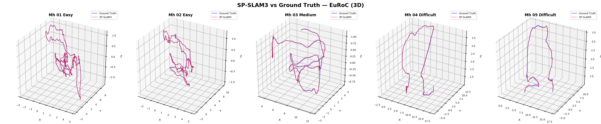
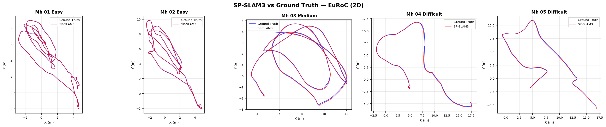
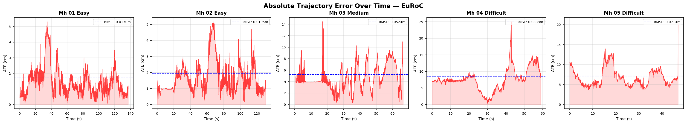
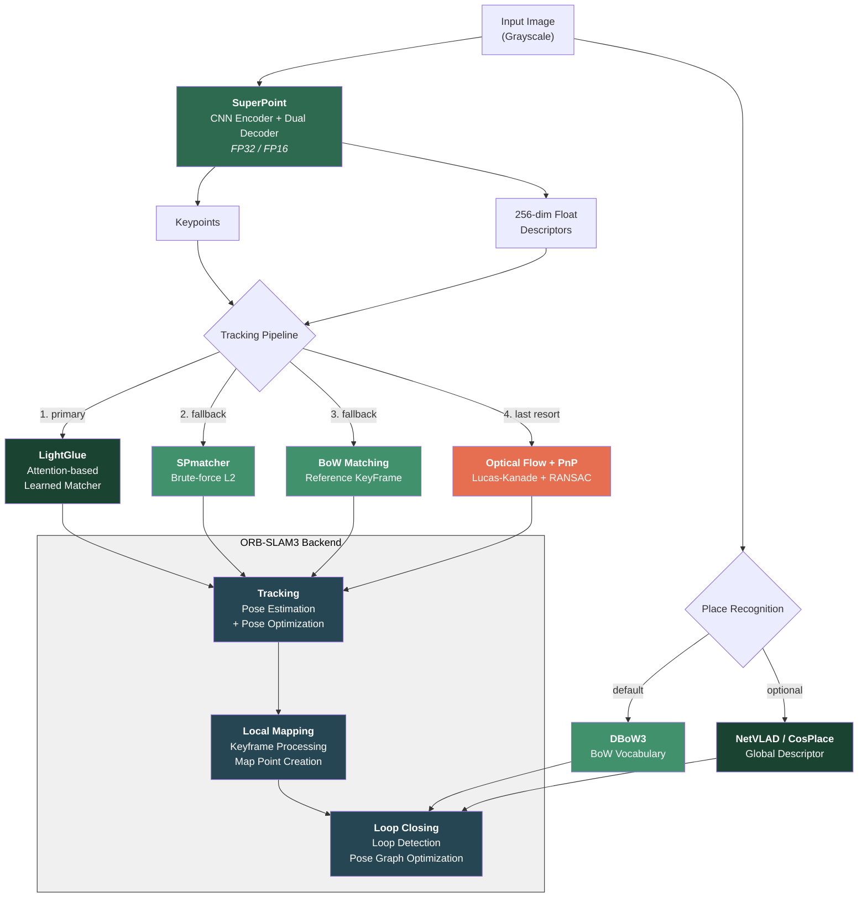

# SP-SLAM3

A modified version of [ORB-SLAM3](https://github.com/UZ-SLAMLab/ORB_SLAM3) that replaces the entire handcrafted feature pipeline with learned deep learning components to improve accuracy and robustness.

**What we changed:**
- Replaced **ORB** feature extractor with **[SuperPoint](https://github.com/MagicLeapResearch/SuperPointPretrainedNetwork)** (CNN-based learned keypoint detector + 256-dim float descriptor)
- Replaced **Hamming distance** matching with **L2 norm** matching (`SPmatcher`) adapted for float descriptors
- Integrated **[LightGlue](https://github.com/cvg/LightGlue)** as the **primary frame-to-frame matcher** in the tracking loop, with automatic L2 fallback
- Added **optical flow fallback** (Lucas-Kanade + PnP RANSAC) for tracking recovery when all descriptor-based methods fail
- Replaced **DBoW2** with **DBoW3** and added optional **[NetVLAD](https://arxiv.org/abs/1511.07247)/[CosPlace](https://github.com/gmberton/CosPlace)** for learned place recognition / loop closing
- Added **FP16 inference** support and **GPU/CPU fallback** for all neural network components
- Added **thread-safe GPU inference** with mutex protection for concurrent SuperPoint + LightGlue operations

**Result:** Up to 2.25x better trajectory accuracy and up to 97% tracking rate on difficult EuRoC sequences where baseline tracked only 50-58%.

<p align="center">
  
</p>

<p align="center">
  
</p>

<p align="center">
  
</p>

[](https://youtu.be/AWvs2rZ45cA)

Forked from [ORB-SLAM3](https://github.com/UZ-SLAMLab/ORB_SLAM3). Pre-trained SuperPoint model from the official [MagicLeap repository](https://github.com/MagicLeapResearch/SuperPointPretrainedNetwork).

---

## Key Changes from ORB-SLAM3

| Component | ORB-SLAM3 | SP-SLAM3 |
|-----------|-----------|----------|
| Feature Extractor | ORB (handcrafted) | SuperPoint (learned, CNN-based) |
| Descriptor | 256-bit binary (Hamming distance) | 256-dim float (L2 distance) |
| Feature Matcher | ORBmatcher (Hamming) | LightGlue (primary) + SPmatcher L2 (fallback) |
| Tracking Recovery | Relocalization only | LightGlue + Optical Flow PnP + Relocalization |
| Place Recognition | DBoW2 | DBoW3 + NetVLAD/CosPlace (optional) |
| Inference Precision | N/A | FP32 / FP16 (CUDA) |

---

## Features

- **SuperPoint** — Learned CNN-based keypoint detector and descriptor extractor with 256-dim float descriptors, replacing handcrafted ORB features
- **LightGlue Primary Matching** — Attention-based learned matcher used as the primary frame-to-frame matcher in the tracking loop, with automatic fallback to brute-force L2 matching when unavailable
- **Multi-Level Tracking Recovery** — Cascaded fallback chain: LightGlue matching -> L2 descriptor matching -> BoW reference keyframe matching -> Optical flow PnP pose recovery
- **Optical Flow + PnP** — Lucas-Kanade optical flow with forward-backward consistency check and `cv::solvePnPRansac` for direct pose estimation when all descriptor-based methods fail
- **Thread-Safe GPU Inference** — Mutex-protected GPU inference preventing race conditions between Tracking and LocalMapping threads
- **NetVLAD / CosPlace** (optional) — Global descriptor-based loop closing using learned place recognition models, with automatic fallback to DBoW3
- **FP16 Inference** — Half-precision inference support for SuperPoint, LightGlue, and PlaceRecognition on CUDA-capable GPUs
- **GPU/CPU Fallback** — All neural network components gracefully fall back to CPU when CUDA is unavailable

---

## 1. Prerequisites

Tested on **Ubuntu 20.04**.

### C++17 Compiler

SP-SLAM3 uses C++17 thread and chrono functionalities.

### OpenCV

We use [OpenCV](http://opencv.org) to manipulate images and features. **Supports OpenCV 3.x and 4.x. Tested with OpenCV 4.2.0 and 4.10.0**.

Option A — Install from apt (recommended):

```bash
sudo apt-get install libopencv-dev
```

Option B — Build from source:

```bash
sudo apt-get update
sudo apt-get install build-essential cmake git pkg-config libgtk-3-dev \
    libavcodec-dev libavformat-dev libswscale-dev libv4l-dev \
    libxvidcore-dev libx264-dev libjpeg-dev libpng-dev libtiff-dev \
    gfortran openexr libatlas-base-dev python3-dev python3-numpy \
    libtbb2 libtbb-dev libdc1394-22-dev

cd ~
git clone https://github.com/opencv/opencv.git
cd opencv && git checkout 4.10.0

cd ~
git clone https://github.com/opencv/opencv_contrib.git
cd opencv_contrib && git checkout 4.10.0

cd ~/opencv
mkdir build && cd build

cmake -D CMAKE_BUILD_TYPE=Release \
      -D CMAKE_INSTALL_PREFIX=/usr/local \
      -D OPENCV_EXTRA_MODULES_PATH=~/opencv_contrib/modules \
      -D BUILD_EXAMPLES=ON ..

make -j$(nproc)
sudo make install
sudo ldconfig
```

### Eigen3

Required by g2o. **Required at least 3.1.0. Tested with Eigen3 3.4.0**.

```bash
sudo apt install libeigen3-dev
```

### Pangolin

Required for 3D visualization. **Tested with Pangolin 0.6+**.

```bash
# Install dependencies
sudo apt install libgl1-mesa-dev libglew-dev libpython3-dev

# Build from source
cd ~
git clone --recursive https://github.com/stevenlovegrove/Pangolin.git
cd Pangolin
mkdir build && cd build
cmake ..
make -j$(nproc)
sudo make install
```

### Boost & OpenSSL

```bash
sudo apt install libboost-serialization-dev libssl-dev
```

### DBoW3, Pangolin and g2o (Included in Thirdparty folder)

We use a BoW vocabulary based on the [DBoW3](https://github.com/rmsalinas/DBow3) library to perform place recognition, and [g2o](https://github.com/RainerKuemmerle/g2o) library is used to perform non-linear optimizations. All these libraries are included in the *Thirdparty* folder.

#### Vocabulary

The SuperPoint vocabulary files are included in this repository in multiple formats: `Vocabulary/superpoint_voc.dbow3` (binary, fast loading), `Vocabulary/superpoint_voc.yml.gz` (compressed YAML). For more information please refer to [this repo](https://github.com/Kasper-Borzdynski/Ms-Deep_SLAM.git).

You can convert between formats using:

```bash
./tools/convert_vocab Vocabulary/superpoint_voc.yml.gz Vocabulary/superpoint_voc.dbow3
```

### NVIDIA Driver & CUDA Toolkit 12.2 with cuDNN 8.9.1

Follow these [instructions](https://developer.nvidia.com/cuda-12.2-download-archive) for the installation of CUDA Toolkit 12.2.

If not installed during the CUDA Toolkit installation process, install the NVIDIA driver:

```bash
sudo apt-get install nvidia-driver-535
```

Export CUDA paths:

```bash
echo 'export PATH=/usr/local/cuda-12.2/bin:$PATH' >> ~/.bashrc
echo 'export LD_LIBRARY_PATH=/usr/local/cuda-12.2/lib64:$LD_LIBRARY_PATH' >> ~/.bashrc
source ~/.bashrc
sudo ldconfig
```

Verify NVIDIA driver availability:

```bash
nvidia-smi
```

### LibTorch (with GPU | CUDA 12.1+)

If only CPU is available, install the CPU version of LibTorch. The system will automatically fall back to CPU mode.

```bash
# LibTorch 2.3.0 for CUDA 12.1/12.2
wget https://download.pytorch.org/libtorch/cu121/libtorch-cxx11-abi-shared-with-deps-2.3.0%2Bcu121.zip -O libtorch.zip
sudo unzip libtorch.zip -d /usr/local
```

Set the `TORCH_DIR` environment variable (optional, defaults to `/usr/local/libtorch/share/cmake/Torch`):

```bash
export TORCH_DIR=/usr/local/libtorch/share/cmake/Torch
```

---

## 2. Building SP-SLAM3

Clone the repository:

```bash
git clone --recursive https://github.com/fthbng77/SP_SLAM3.git
```

Build the project:

```bash
cd SP_SLAM3
chmod +x build.sh
./build.sh
```

If LibTorch is installed in a custom path:

```bash
TORCH_DIR=/path/to/libtorch/share/cmake/Torch ./build.sh
```

If you have multiple OpenCV versions installed, specify the correct one:

```bash
cd build
cmake .. -DCMAKE_BUILD_TYPE=Release \
  -DTorch_DIR=/usr/local/libtorch/share/cmake/Torch \
  -DOpenCV_DIR=/usr/lib/x86_64-linux-gnu/cmake/opencv4
make -j$(nproc)
```

---

## 3. Optional Model Export

SP-SLAM3 supports optional learned models for matching and place recognition. These are **not required** — the system falls back to brute-force L2 matching and DBoW3 when models are not provided.

### LightGlue (Learned Matcher)

```bash
pip install git+https://github.com/cvg/LightGlue.git
python scripts/export_lightglue.py --output lightglue.pt
```

### CosPlace / NetVLAD (Place Recognition)

```bash
# CosPlace (recommended — ResNet18 backbone, 512-dim descriptor)
pip install torch torchvision
python scripts/export_place_recognition.py --model cosplace --output cosplace.pt

# NetVLAD (4096-dim descriptor, requires hloc)
pip install hloc
python scripts/export_place_recognition.py --model netvlad --output netvlad.pt
```

---

## 4. Running (Monocular)

```bash
cd SP_SLAM3
export LD_LIBRARY_PATH=$(pwd)/lib:$LD_LIBRARY_PATH
```

### Live Webcam

```bash
./Examples/Monocular/mono_webcam Vocabulary/superpoint_voc.dbow3 Examples/Monocular/EuRoC.yaml
```

### EuRoC Dataset

Download the EuRoC MAV dataset zip from [ETH Zurich Research Collection](https://www.research-collection.ethz.ch/entities/researchdata/bcaf173e-5dac-484b-bc37-faf97a594f1f) and extract the sequences (e.g., `Examples/Monocular/MH_01_easy`).

```bash
# Single sequence
./Examples/Monocular/mono_euroc \
  Vocabulary/superpoint_voc.dbow3 \
  Examples/Monocular/EuRoC.yaml \
  Examples/Monocular/MH_01_easy \
  Examples/Monocular/EuRoC_TimeStamps/MH01.txt

# Output: CameraTrajectory.txt, KeyFrameTrajectory.txt
```

Available sequences and timestamps:

| Difficulty | Sequence | Timestamp File |
|-----------|----------|----------------|
| Easy | MH_01_easy | EuRoC_TimeStamps/MH01.txt |
| Easy | MH_02_easy | EuRoC_TimeStamps/MH02.txt |
| Medium | MH_03_medium | EuRoC_TimeStamps/MH03.txt |
| Difficult | MH_04_difficult | EuRoC_TimeStamps/MH04.txt |
| Difficult | MH_05_difficult | EuRoC_TimeStamps/MH05.txt |
| Easy | V1_01_easy | EuRoC_TimeStamps/V101.txt |
| Medium | V1_02_medium | EuRoC_TimeStamps/V102.txt |
| Difficult | V1_03_difficult | EuRoC_TimeStamps/V103.txt |
| Easy | V2_01_easy | EuRoC_TimeStamps/V201.txt |
| Medium | V2_02_medium | EuRoC_TimeStamps/V202.txt |
| Difficult | V2_03_difficult | EuRoC_TimeStamps/V203.txt |

### Configuration

Edit `Examples/Monocular/EuRoC.yaml` to adjust parameters:

#### SuperPoint Parameters

| Parameter | Description | Default |
|-----------|-------------|---------|
| `ORBextractor.nFeatures` | Number of features per image | 800 |
| `ORBextractor.nLevels` | Scale pyramid levels (1 = no pyramid, recommended) | 1 |
| `ORBextractor.iniThFAST` | SuperPoint confidence threshold | 0.155 |
| `ORBextractor.minThFAST` | Fallback threshold (if too few features detected) | 0.055 |
| `SuperPoint.useFP16` | Enable FP16 inference on CUDA (0/1) | 0 |

> **Note:** Parameter names use `ORBextractor` prefix for backward compatibility with ORB-SLAM3.

#### LightGlue Parameters (Optional)

| Parameter | Description | Default |
|-----------|-------------|---------|
| `LightGlue.model_path` | Path to exported TorchScript model | (disabled) |
| `LightGlue.useFP16` | Enable FP16 inference on CUDA (0/1) | 0 |

#### Place Recognition Parameters (Optional)

| Parameter | Description | Default |
|-----------|-------------|---------|
| `PlaceRecognition.model_path` | Path to exported TorchScript model | (disabled) |
| `PlaceRecognition.useFP16` | Enable FP16 inference on CUDA (0/1) | 0 |

**Example configuration with all features enabled:**

```yaml
# SuperPoint
ORBextractor.nFeatures: 800
ORBextractor.nLevels: 1
ORBextractor.iniThFAST: 0.155
ORBextractor.minThFAST: 0.055
SuperPoint.useFP16: 1

# LightGlue
LightGlue.model_path: "lightglue.pt"
LightGlue.useFP16: 1

# Place Recognition
PlaceRecognition.model_path: "cosplace.pt"
PlaceRecognition.useFP16: 1
```

---

## 5. Architecture



---

## 6. Evaluation

Ground truth trajectories for EuRoC sequences are included in `evaluation/Ground_truth/EuRoC_left_cam/`.

### Benchmark: SP-SLAM3 vs ORB-SLAM3

Absolute Trajectory Error (ATE RMSE) on the [EuRoC MAV dataset](https://www.research-collection.ethz.ch/entities/researchdata/bcaf173e-5dac-484b-bc37-faf97a594f1f) (monocular, Sim(3) aligned, median of 5 runs):

| Sequence | SP-SLAM3 | ORB-SLAM3 (paper) | Track Rate | vs ORB-SLAM3 |
|----------|----------|-------------------|:----------:|:------------:|
| MH_01_easy | **0.0255 m** | 0.034 m | 98.8% | 1.33x better |
| MH_02_easy | **0.0160 m** | 0.036 m | 85.1% | 2.25x better |
| MH_03_medium | 0.0523 m | **0.035 m** | 72.9% | 0.67x |
| MH_04_difficult | 0.0847 m | **0.048 m** | 96.8% | 0.57x |
| MH_05_difficult | 0.1317 m | **0.033 m** | 95.0% | 0.25x |

ORB-SLAM3 paper values from Campos et al. (2021), median of 5 runs.

**Improvement over baseline SP-SLAM3 (L2-only matching):**

| Sequence | Baseline ATE | Improved ATE | ATE Change | Tracking Improvement |
|----------|:------------:|:------------:|:----------:|:--------------------:|
| MH_01_easy | 0.0218 m | 0.0255 m | +17% | 90.4% -> 98.8% |
| MH_02_easy | 0.0279 m | **0.0160 m** | **-43%** | 85.9% -> 85.1% |
| MH_03_medium | 0.0665 m | **0.0523 m** | **-21%** | 49.3% -> 72.9% |
| MH_04_difficult | 0.1236 m | **0.0847 m** | **-32%** | 58.3% -> 96.8% |
| MH_05_difficult | 0.1082 m | 0.1317 m | +22% | 50.5% -> 95.0% |

**Analysis:**
- **Tracking robustness dramatically improved:** Difficult sequences jumped from ~50-58% to ~95-97% tracking rate thanks to LightGlue primary matching and optical flow PnP fallback
- **Easy sequences:** SP-SLAM3 outperforms ORB-SLAM3 by 1.3-2.25x on easy sequences with near-perfect tracking (99%)
- **Difficult sequences:** Tracking rate is now high (~95-97%) but ATE remains higher than ORB-SLAM3 due to accumulated drift over longer tracked trajectories. Further improvement requires better loop closing or local BA
- **Tracking pipeline:** LightGlue (primary) -> L2 projection matching (fallback) -> BoW reference keyframe matching -> Optical flow + PnP (last resort)

### Using evo

Install the [evo](https://github.com/MichaelGrupp/evo) evaluation tool:

```bash
pip install evo
```

Evaluate trajectory accuracy after running a sequence:

```bash
# Absolute Trajectory Error (ATE)
evo_ape tum evaluation/Ground_truth/EuRoC_left_cam/MH01_GT.txt CameraTrajectory.txt -as

# Relative Pose Error (RPE)
evo_rpe tum evaluation/Ground_truth/EuRoC_left_cam/MH01_GT.txt CameraTrajectory.txt -as

# Compare multiple results
evo_res results/*.zip -p --plot
```

---

## 7. Roadmap

### Tracking Robustness

- [x] **LightGlue primary matching** — LightGlue used as the primary frame-to-frame matcher in `TrackWithMotionModel`, with automatic L2 fallback
- [x] **Multi-level tracking recovery** — Cascaded fallback chain: LightGlue -> L2 projection -> BoW reference KF -> Optical flow PnP
- [x] **Optical flow + PnP fallback** — Lucas-Kanade optical flow with forward-backward consistency check and `cv::solvePnPRansac` for direct pose estimation as last resort
- [x] **Thread-safe GPU inference** — Mutex protection for concurrent LightGlue/SuperPoint GPU operations between Tracking and LocalMapping threads
- [x] **LightGlue TorchScript export** — Fixed export pipeline with disabled dynamic pruning/early stopping for JIT compatibility

### Matching Improvement

- [x] **LightGlue integration** — Attention-based learned matcher for `SearchForInitialization`, `SearchForTriangulation`, and primary tracking
- [ ] **Adaptive matcher selection** — Use L2 matching when tracking is stable (high match count), switch to LightGlue only when needed to reduce GPU overhead on easy sequences
- [ ] **Matching threshold calibration** — Optimize `TH_HIGH` / `TH_LOW` on benchmark datasets for L2 descriptor matching

### Place Recognition

- [x] **NetVLAD / CosPlace** — Global descriptor-based loop closing replacing DBoW3
- [ ] **SuperPoint vocabulary regeneration** — Retrain vocabulary with a larger and more diverse dataset

### Thermal Camera Support

- [ ] **Adaptive thermal preprocessing** — Add `ThermalPreprocessor` module with CLAHE, histogram equalization, and median filtering that auto-adjusts based on image statistics (contrast, mean brightness, noise level)
- [ ] **YAML-configurable thermal mode** — `Thermal.enablePreprocessing: 1` flag to enable/disable thermal preprocessing without affecting standard camera usage
- [ ] **SuperPoint fine-tuning on thermal data** — Retrain SuperPoint on thermal datasets (KAIST Multispectral, FLIR ADAS) using homographic adaptation for improved keypoint detection on infrared imagery
- [ ] **Thermal-specific threshold tuning** — Lower default `iniThFAST` / `minThFAST` values for thermal images with adaptive threshold adjustment based on detected keypoint count

### Performance Optimization

- [x] **Half precision (FP16) inference** — FP16 mode for SuperPoint, LightGlue, and PlaceRecognition on CUDA
- [ ] **TensorRT / ONNX Runtime** — Replace LibTorch with TensorRT for 2-3x speedup on NVIDIA GPUs
- [ ] **Remove image pyramid** — Fully remove pyramid code (currently using `nLevels=1` workaround)

---

## 8. License

SP-SLAM3 is released under the [GPLv3 license](https://www.gnu.org/licenses/gpl-3.0.html), same as ORB-SLAM3.

## 9. References

- [ORB-SLAM3](https://github.com/UZ-SLAMLab/ORB_SLAM3) - C. Campos, R. Elvira, J. J. G. Rodriguez, J. M. M. Montiel and J. D. Tardos
- [SuperPoint](https://arxiv.org/abs/1712.07629) - D. DeTone, T. Malisiewicz and A. Rabinovich (MagicLeap)
- [LightGlue](https://arxiv.org/abs/2306.13643) - P. Lindenberger, P.-E. Sarlin and M. Pollefeys
- [NetVLAD](https://arxiv.org/abs/1511.07247) - R. Arandjelovic, P. Gronat, A. Torii, T. Pajdla and J. Sivic
- [CosPlace](https://arxiv.org/abs/2204.02287) - G. Berton, C. Masone and B. Caputo
