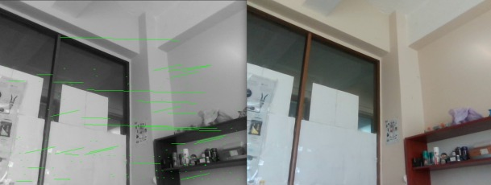
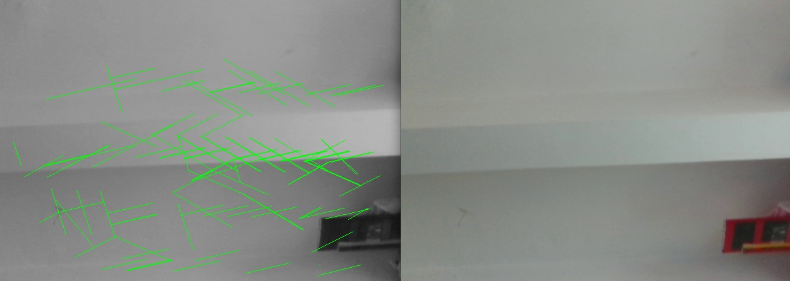
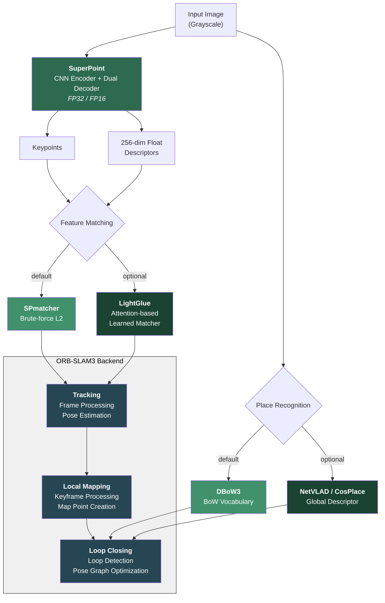

# SP-SLAM3

**SuperPoint + ORB-SLAM3**: A visual SLAM system that replaces the handcrafted ORB feature extractor with learned deep learning components — [SuperPoint](https://github.com/MagicLeapResearch/SuperPointPretrainedNetwork) for feature detection/description, [LightGlue](https://github.com/cvg/LightGlue) for learned feature matching, and [NetVLAD](https://arxiv.org/abs/1511.07247)/[CosPlace](https://github.com/gmberton/CosPlace) for place recognition.




[](https://youtu.be/AWvs2rZ45cA)

This repository was forked from [ORB-SLAM3](https://github.com/UZ-SLAMLab/ORB_SLAM3). The pre-trained SuperPoint model comes from the official [MagicLeap repository](https://github.com/MagicLeapResearch/SuperPointPretrainedNetwork).

---

## Key Changes from ORB-SLAM3

| Component | ORB-SLAM3 | SP-SLAM3 |
|-----------|-----------|----------|
| Feature Extractor | ORB (handcrafted) | SuperPoint (learned, CNN-based) |
| Descriptor | 256-bit binary (Hamming distance) | 256-dim float (L2 distance) |
| Feature Matcher | ORBmatcher (Hamming) | SPmatcher (L2 norm) + LightGlue (optional) |
| Place Recognition | DBoW2 | DBoW3 + NetVLAD/CosPlace (optional) |
| Inference Precision | N/A | FP32 / FP16 (CUDA) |

---

## Features

- **SuperPoint** — Learned CNN-based keypoint detector and descriptor extractor with 256-dim float descriptors, replacing handcrafted ORB features
- **LightGlue** (optional) — Attention-based learned matcher for SuperPoint descriptors, used in monocular initialization and triangulation with automatic fallback to brute-force L2 matching
- **NetVLAD / CosPlace** (optional) — Global descriptor-based loop closing using learned place recognition models, with automatic fallback to DBoW3
- **FP16 Inference** — Half-precision inference support for SuperPoint, LightGlue, and PlaceRecognition on CUDA-capable GPUs
- **GPU/CPU Fallback** — All neural network components gracefully fall back to CPU when CUDA is unavailable

---

## 1. Prerequisites

Tested on **Ubuntu 20.04**.

### C++17 Compiler

SP-SLAM3 uses C++17 thread and chrono functionalities.

### OpenCV

We use [OpenCV](http://opencv.org) to manipulate images and features. **Supports OpenCV 3.x and 4.x. Tested with OpenCV 4.2.0 and 4.10.0**.

Option A — Install from apt (recommended):

```bash
sudo apt-get install libopencv-dev
```

Option B — Build from source:

```bash
sudo apt-get update
sudo apt-get install build-essential cmake git pkg-config libgtk-3-dev \
    libavcodec-dev libavformat-dev libswscale-dev libv4l-dev \
    libxvidcore-dev libx264-dev libjpeg-dev libpng-dev libtiff-dev \
    gfortran openexr libatlas-base-dev python3-dev python3-numpy \
    libtbb2 libtbb-dev libdc1394-22-dev

cd ~
git clone https://github.com/opencv/opencv.git
cd opencv && git checkout 4.10.0

cd ~
git clone https://github.com/opencv/opencv_contrib.git
cd opencv_contrib && git checkout 4.10.0

cd ~/opencv
mkdir build && cd build

cmake -D CMAKE_BUILD_TYPE=Release \
      -D CMAKE_INSTALL_PREFIX=/usr/local \
      -D OPENCV_EXTRA_MODULES_PATH=~/opencv_contrib/modules \
      -D BUILD_EXAMPLES=ON ..

make -j$(nproc)
sudo make install
sudo ldconfig
```

### Eigen3

Required by g2o. **Required at least 3.1.0. Tested with Eigen3 3.4.0**.

```bash
sudo apt install libeigen3-dev
```

### DBoW3, Pangolin and g2o (Included in Thirdparty folder)

We use a BoW vocabulary based on the [DBoW3](https://github.com/rmsalinas/DBow3) library to perform place recognition, and [g2o](https://github.com/RainerKuemmerle/g2o) library is used to perform non-linear optimizations. All these libraries are included in the *Thirdparty* folder.

#### Vocabulary

The SuperPoint vocabulary file (`Vocabulary/superpoint_voc.yml.gz`) is included in this repository. For more information please refer to [this repo](https://github.com/Kasper-Borzdynski/Ms-Deep_SLAM.git).

### NVIDIA Driver & CUDA Toolkit 12.2 with cuDNN 8.9.1

Follow these [instructions](https://developer.nvidia.com/cuda-12.2-download-archive) for the installation of CUDA Toolkit 12.2.

If not installed during the CUDA Toolkit installation process, install the NVIDIA driver:

```bash
sudo apt-get install nvidia-driver-535
```

Export CUDA paths:

```bash
echo 'export PATH=/usr/local/cuda-12.2/bin:$PATH' >> ~/.bashrc
echo 'export LD_LIBRARY_PATH=/usr/local/cuda-12.2/lib64:$LD_LIBRARY_PATH' >> ~/.bashrc
source ~/.bashrc
sudo ldconfig
```

Verify NVIDIA driver availability:

```bash
nvidia-smi
```

### LibTorch (with GPU | CUDA 12.1+)

If only CPU is available, install the CPU version of LibTorch. The system will automatically fall back to CPU mode.

```bash
# LibTorch 2.3.0 for CUDA 12.1/12.2
wget https://download.pytorch.org/libtorch/cu121/libtorch-cxx11-abi-shared-with-deps-2.3.0%2Bcu121.zip -O libtorch.zip
sudo unzip libtorch.zip -d /usr/local
```

Set the `TORCH_DIR` environment variable (optional, defaults to `/usr/local/libtorch/share/cmake/Torch`):

```bash
export TORCH_DIR=/usr/local/libtorch/share/cmake/Torch
```

---

## 2. Building SP-SLAM3

Clone the repository:

```bash
git clone --recursive https://github.com/fthbng77/SP_SLAM3.git
```

Build the project:

```bash
cd SP_SLAM3
chmod +x build.sh
./build.sh
```

If LibTorch is installed in a custom path:

```bash
TORCH_DIR=/path/to/libtorch/share/cmake/Torch ./build.sh
```

If you have multiple OpenCV versions installed, specify the correct one:

```bash
cd build
cmake .. -DCMAKE_BUILD_TYPE=Release \
  -DTorch_DIR=/usr/local/libtorch/share/cmake/Torch \
  -DOpenCV_DIR=/usr/lib/x86_64-linux-gnu/cmake/opencv4
make -j$(nproc)
```

---

## 3. Optional Model Export

SP-SLAM3 supports optional learned models for matching and place recognition. These are **not required** — the system falls back to brute-force L2 matching and DBoW3 when models are not provided.

### LightGlue (Learned Matcher)

```bash
pip install lightglue
python scripts/export_lightglue.py --output lightglue.pt
```

### CosPlace / NetVLAD (Place Recognition)

```bash
# CosPlace (recommended — ResNet18 backbone, 512-dim descriptor)
pip install torch torchvision
python scripts/export_place_recognition.py --model cosplace --output cosplace.pt

# NetVLAD (4096-dim descriptor, requires hloc)
pip install hloc
python scripts/export_place_recognition.py --model netvlad --output netvlad.pt
```

---

## 4. Running (Monocular)

```bash
cd SP_SLAM3
export LD_LIBRARY_PATH=$(pwd)/lib:$LD_LIBRARY_PATH

# Run with SuperPoint vocabulary (recommended)
./Examples/Monocular/mono_webcam Vocabulary/superpoint_voc.yml Examples/Monocular/EuRoC.yaml

# Or run with ORB vocabulary
./Examples/Monocular/mono_webcam Vocabulary/ORBvoc.txt Examples/Monocular/EuRoC.yaml
```

### Configuration

Edit `Examples/Monocular/EuRoC.yaml` to adjust parameters:

#### SuperPoint Parameters

| Parameter | Description | Default |
|-----------|-------------|---------|
| `ORBextractor.nFeatures` | Number of features per image | 800 |
| `ORBextractor.nLevels` | Scale pyramid levels (1 = no pyramid, recommended) | 1 |
| `ORBextractor.iniThFAST` | SuperPoint confidence threshold | 0.155 |
| `ORBextractor.minThFAST` | Fallback threshold (if too few features detected) | 0.055 |
| `SuperPoint.useFP16` | Enable FP16 inference on CUDA (0/1) | 0 |

> **Note:** Parameter names use `ORBextractor` prefix for backward compatibility with ORB-SLAM3.

#### LightGlue Parameters (Optional)

| Parameter | Description | Default |
|-----------|-------------|---------|
| `LightGlue.model_path` | Path to exported TorchScript model | (disabled) |
| `LightGlue.useFP16` | Enable FP16 inference on CUDA (0/1) | 0 |

#### Place Recognition Parameters (Optional)

| Parameter | Description | Default |
|-----------|-------------|---------|
| `PlaceRecognition.model_path` | Path to exported TorchScript model | (disabled) |
| `PlaceRecognition.useFP16` | Enable FP16 inference on CUDA (0/1) | 0 |

**Example configuration with all features enabled:**

```yaml
# SuperPoint
ORBextractor.nFeatures: 800
ORBextractor.nLevels: 1
ORBextractor.iniThFAST: 0.155
ORBextractor.minThFAST: 0.055
SuperPoint.useFP16: 1

# LightGlue
LightGlue.model_path: "lightglue.pt"
LightGlue.useFP16: 1

# Place Recognition
PlaceRecognition.model_path: "cosplace.pt"
PlaceRecognition.useFP16: 1
```

---

## 5. Architecture



---

## 6. Roadmap

### Matching Improvement

- [x] **LightGlue integration** — Attention-based learned matcher for `SearchForInitialization` and `SearchForTriangulation`
- [ ] **Extend LightGlue** — Apply to `SearchByProjection` for difficult scenes
- [ ] **Matching threshold calibration** — Optimize `TH_HIGH` / `TH_LOW` on benchmark datasets for L2 descriptor matching

### Place Recognition

- [x] **NetVLAD / CosPlace** — Global descriptor-based loop closing replacing DBoW3
- [ ] **SuperPoint vocabulary regeneration** — Retrain vocabulary with a larger and more diverse dataset

### Performance Optimization

- [x] **Half precision (FP16) inference** — FP16 mode for SuperPoint, LightGlue, and PlaceRecognition on CUDA
- [ ] **TensorRT / ONNX Runtime** — Replace LibTorch with TensorRT for 2-3x speedup on NVIDIA GPUs
- [ ] **Remove image pyramid** — Fully remove pyramid code (currently using `nLevels=1` workaround)

---

## 7. License

SP-SLAM3 is released under the [GPLv3 license](https://www.gnu.org/licenses/gpl-3.0.html), same as ORB-SLAM3.

## 8. References

- [ORB-SLAM3](https://github.com/UZ-SLAMLab/ORB_SLAM3) - C. Campos, R. Elvira, J. J. G. Rodriguez, J. M. M. Montiel and J. D. Tardos
- [SuperPoint](https://arxiv.org/abs/1712.07629) - D. DeTone, T. Malisiewicz and A. Rabinovich (MagicLeap)
- [LightGlue](https://arxiv.org/abs/2306.13643) - P. Lindenberger, P.-E. Sarlin and M. Pollefeys
- [NetVLAD](https://arxiv.org/abs/1511.07247) - R. Arandjelovic, P. Gronat, A. Torii, T. Pajdla and J. Sivic
- [CosPlace](https://arxiv.org/abs/2204.02287) - G. Berton, C. Masone and B. Caputo
